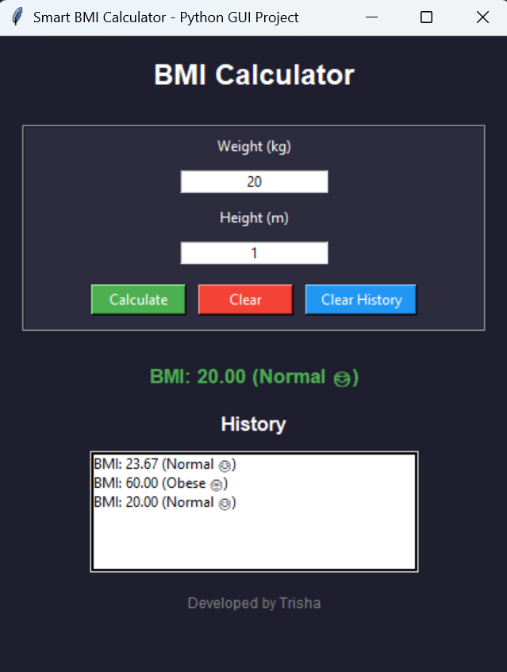

# BMI Calculator GUI (Python)

A simple and user-friendly BMI Calculator built using Python and Tkinter.

---

## 🚀 Features
- GUI-based application  
- Input validation  
- BMI calculation  
- Category detection (Underweight, Normal, Overweight, Obese)  
- History tracking  
- Clean and modern UI  

---

## 📸 Screenshots

### Main Interface


### Result Output


---

## ▶️ How to Run

```bash
python bmi.py
