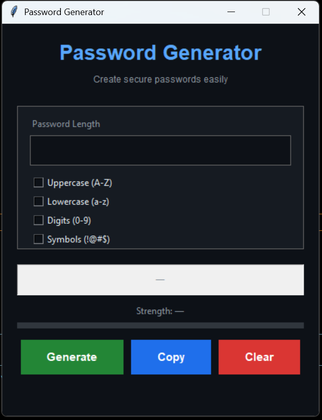
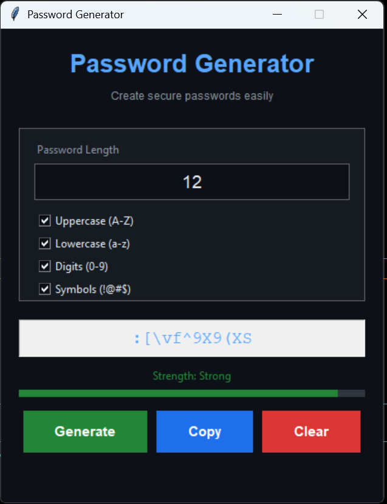

# 🔐 Password Generator (Python GUI)

A simple and secure password generator built using Python and Tkinter.

---

## 🚀 Features
- Generate strong random passwords
- Custom length (4–32)
- Choose character types (uppercase, lowercase, digits, symbols)
- Input validation
- Copy to clipboard
- Clean GUI design

---

## 📸 Screenshots

### Main Interface


### Generated Output


---

## 🛠 Tech Used
- Python
- Tkinter
- Random & String modules

---

## ▶️ How to Run

```bash
python password.py
