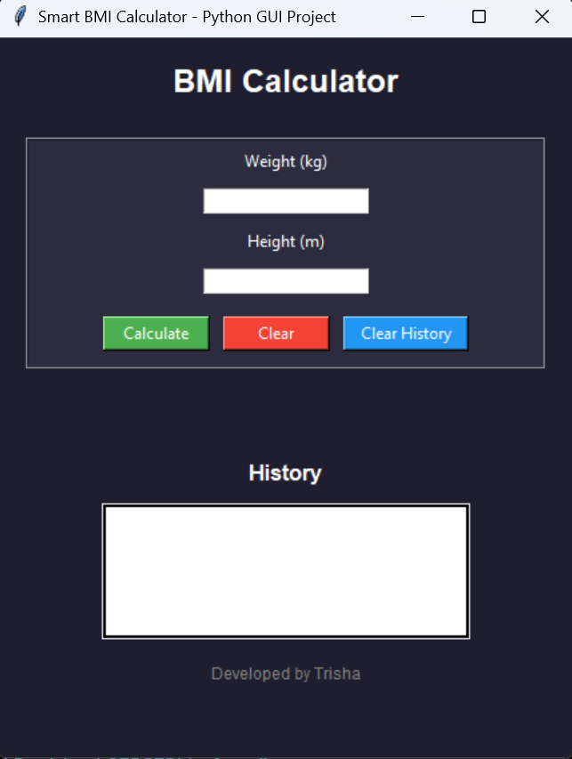

# 💻 BMI Calculator GUI (Python)

A simple and user-friendly BMI Calculator built using Python and Tkinter.

---

## 🚀 Features
- GUI-based application
- Input validation
- BMI category detection
- History tracking
- Clean and modern UI

---

## 📸 Screenshots

### 🖥️ Main Interface


### 📊 Result Output


---

## 🛠️ Tech Used
- Python
- Tkinter

---

## 📌 How to Run
```bash
python bmi.py
```

---

## 👩‍💻 Author
Trisha
