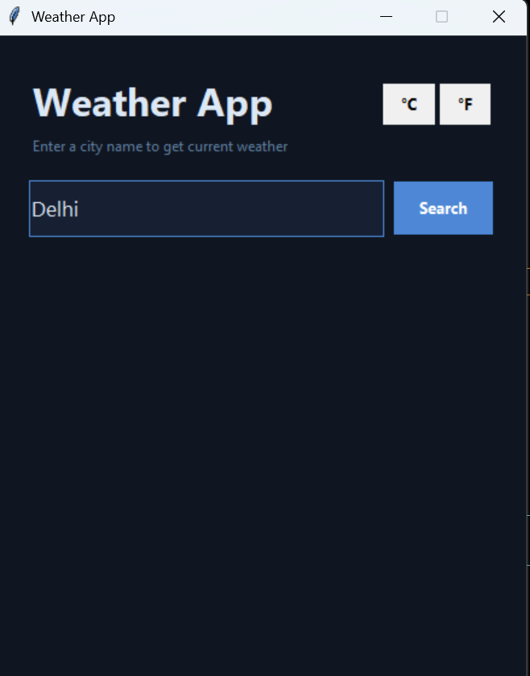
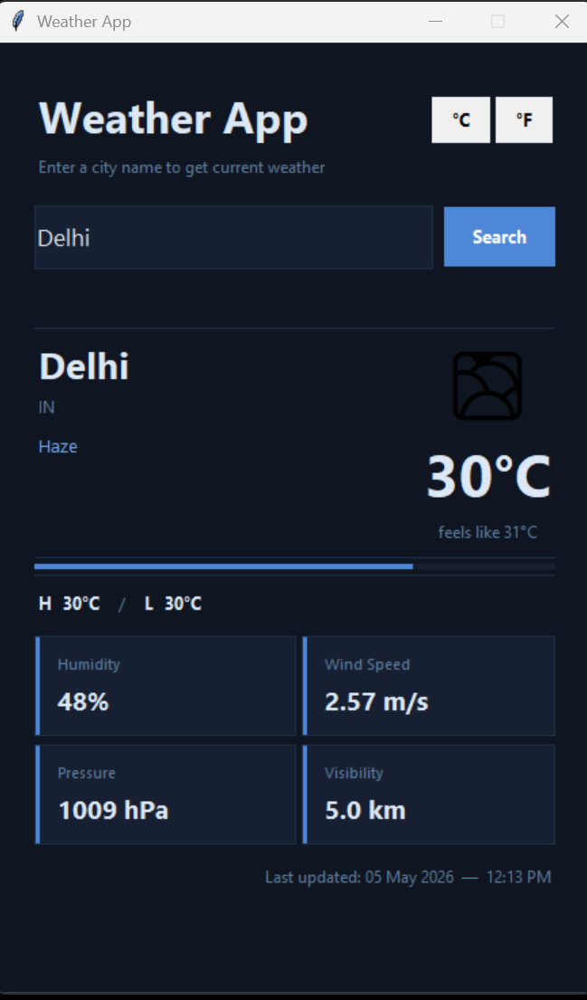

# 🌦 Weather App (Python Tkinter)

A simple GUI-based weather application that fetches real-time weather data using OpenWeather API.

---

## 🚀 Features
- Fetch real-time weather
- Input validation
- Temperature, humidity, wind details
- Clean GUI using Tkinter

---

## 📸 Screenshots

### UI

### Output

---

## ▶ How to Run
1. Get API key from https://openweathermap.org/
2. Replace API_KEY in code
3. Run python file
